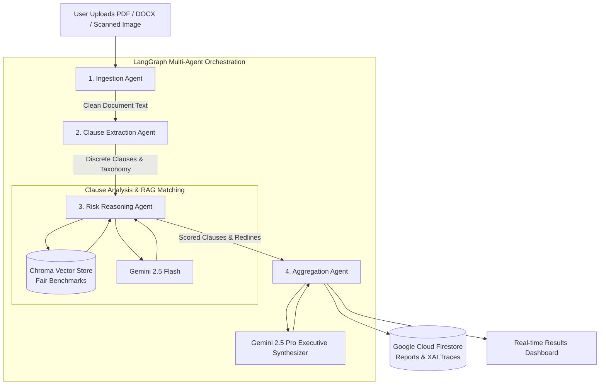

# LexGuard — AI Rights & Contract Intelligence System

[](https://github.com/Bellamkonda-Nokesh/LexGuard-_AI-Rights-Contract-Intelligence-System/actions/workflows/ci.yml)
[](https://fastapi.tiangolo.com)
[](https://langchain-ai.github.io/langgraph/)
[](https://ai.google.dev/)
[](https://vitejs.dev/)
[](https://www.w3.org/WAI/WCAG21/quickref/)

> **IMPORTANT LEGAL DISCLAIMER:** LexGuard is an automated AI intelligence tool designed for preliminary review and informational purposes only. LexGuard does **NOT** provide formal legal opinions, legal advice, or attorney representation. Always consult a qualified, licensed attorney before signing or executing any legal agreement.

---

## 1. Chosen Vertical & Problem Statement

**Vertical:** Legal Tech, Consumer Rights Protection & Contract Intelligence.

Modern agreements—such as employment contracts, enterprise SaaS terms, commercial leases, and privacy policies—are deliberately loaded with complex legalese, hidden liabilities, and aggressive one-sided covenants. The average signer cannot afford hundreds of dollars per hour for an attorney to review standard paperwork, resulting in unintended waivers of rights, surprise multi-year auto-renewals, and perpetual restrictive covenants.

**LexGuard** bridges this power asymmetry by providing an autonomous, multi-agent AI system that:
1. Deconstructs contracts into discrete clauses.
2. Identifies unfair, predatory, or ambiguous language.
3. Compares clauses against standard fair industry benchmarks via semantic vector search.
4. Explains the real-world implications in plain, non-legal terminology.
5. Equips the signer with concrete counter-proposal redline language.

---

## 2. System Architecture

### Multi-Agent Pipeline Diagram (Mermaid)



### ASCII Architecture Overview

```text
+-----------------------------------------------------------------------------------+
|                            LexGuard Frontend (React + Vite)                       |
|  - Drag & Drop Upload Zone    - Overall Risk Gauge (0-100)  - Filterable Clauses  |
|  - Plain English Translation  - Fair Benchmark Comparison   - Counter Redlines    |
|  - Explainability Trace Panel - WCAG 2.1 AA Compliant Theme - Firebase Auth Client|
+------------------------------------------+----------------------------------------+
                                           | HTTPS / REST JSON
                                           v
+-----------------------------------------------------------------------------------+
|                         LexGuard Backend (FastAPI + LangGraph)                    |
|                                                                                   |
|  [Agent 1: Ingestion]  -->  [Agent 2: Extraction]  -->  [Agent 3: Risk Reasoning] |
|   - pdfplumber/docx          - Gemini 2.5 Flash          - Chroma Vector RAG      |
|   - Multimodal OCR           - Category Taxonomy         - Hidden Liabilities     |
|   - Text Sanitizer                                       - Plain English & Redline|
|                                                                  |                |
|                                                                  v                |
|                                                      [Agent 4: Aggregation]       |
|                                                       - Gemini 2.5 Pro Synthesis  |
|                                                       - Weighted Risk Rollup      |
+----------------------+--------------------+----------------------+----------------+
                       |                    |                      |
                       v                    v                      v
             [Google Gemini API]   [Chroma Vector Store]   [Google Cloud Firestore]
              - gemini-2.5-flash    - Fair Clause Library   - User Sessions
              - gemini-2.5-pro      - text-embedding-004    - Document Metadata
              - Native Vision OCR                           - Audit Reasoning Traces
```

---

## 3. Approach & Problem Statement Alignment

| Problem Statement Objective | Architectural Implementation | Code Location |
| :--- | :--- | :--- |
| **Multi-format Document Analysis** (PDF, DOCX, Scanned Images via OCR) | `DocumentParserService` combines `pdfplumber` for text PDFs, `python-docx` for Word, and native **Gemini Multimodal OCR** for scanned PDFs/images without heavy Tesseract binaries. | `backend/app/services/document_parser.py` |
| **Clause Extraction & Classification** (7+ categories) | `ClauseExtractionAgent` uses `gemini-2.5-flash` to segment raw documents into discrete covenants across employment, subscription, vendor, rental, insurance, ToS, and privacy domains. | `backend/app/agents/clause_extraction_agent.py` |
| **Identification of Hidden Liabilities & Restrictions** | `RiskReasoningAgent` detects non-competes, silent auto-renewals, arbitration waivers, unilateral indemnity, and excessive telemetry. | `backend/app/agents/risk_reasoning_agent.py` |
| **Detection of Ambiguous / Contradictory Terms** | Integrated checks detect vague phrasing (e.g., "reasonable efforts", "undefined affiliates") and highlight them as separate risk items. | `backend/app/agents/risk_reasoning_agent.py` |
| **Severity-based Risk Scoring** (Per-clause + overall document score) | Per-clause severity (`Low`, `Medium`, `High`, `Critical`) and composite 0-100 document score calculated via weighted rollup. | `backend/app/agents/risk_reasoning_agent.py`<br/>`backend/app/agents/aggregation_agent.py` |
| **Plain-Language Translations** | Explains each covenant in simple, conversational language specifically answering *"What this means for you in practice."* | `backend/app/agents/risk_reasoning_agent.py`<br/>`frontend/src/components/ClauseCard.tsx` |
| **Standard Fair Clause Benchmarking** | Chroma vector store semantic search retrieves balanced standard clauses from a pre-seeded benchmark library. | `backend/app/services/vector_store.py`<br/>`backend/app/data/benchmark_clauses.json` |
| **Negotiation Counter-Recommendations** | Generates tailored redline language and balanced replacement wording ready to copy into contract negotiations. | `backend/app/agents/risk_reasoning_agent.py`<br/>`frontend/src/components/ClauseCard.tsx` |
| **Persistent Legal Disclaimer** | Visible across top navigation banner, upload page, report header, and footer; attached to all API payloads. | `frontend/src/components/DisclaimerBanner.tsx`<br/>`backend/app/models/schemas.py` |
| **Real-time Synchronous Use** | Async execution pipeline finishes within a single web session with zero offline batch delays. | `backend/app/agents/pipeline.py`<br/>`backend/app/api/routes.py` |
| **Explainable AI (XAI)** | Full cognitive execution traces from all 4 agents logged to Firestore and rendered in an interactive timeline UI. | `backend/app/agents/aggregation_agent.py`<br/>`frontend/src/components/ExplainabilityPanel.tsx` |

---

## 4. Google Services Used & Exact Code Locations

LexGuard leverages Google Cloud & Firebase infrastructure across its entire lifecycle:

1. **Google Gemini API (`gemini-2.5-flash`)**
   - **Where:** `backend/app/services/gemini_client.py` (`generate_json`, `analyze_multimodal`), `backend/app/agents/clause_extraction_agent.py`, and `backend/app/agents/risk_reasoning_agent.py`.
   - **Role:** High-speed clause extraction, multimodal vision OCR fallback for scanned contracts, and initial clause risk evaluation.
2. **Google Gemini API (`gemini-2.5-pro`)**
   - **Where:** `backend/app/services/gemini_client.py`, `backend/app/agents/aggregation_agent.py`.
   - **Role:** Executive legal synthesis, risk level rollup, and strategic negotiation prioritization.
3. **Google text-embedding-004**
   - **Where:** `backend/app/services/gemini_client.py` (`get_embedding`), `backend/app/services/vector_store.py`.
   - **Role:** Semantic vector embeddings for fair clause benchmark indexing and similarity matching.
4. **Google Cloud Firestore**
   - **Where:** `backend/app/services/firestore_service.py` (`save_document_report`, `log_agent_trace`, `list_user_documents`), `firestore.rules`.
   - **Role:** Persistent document metadata storage, risk reports, and granular agent reasoning traces with user-scoped security rules.
5. **Firebase Authentication**
   - **Where:** `frontend/src/services/firebase.ts`, `frontend/src/components/AuthModal.tsx`, `backend/app/api/routes.py` (`extract_user_id`).
   - **Role:** Secure user identity management with Google Sign-in and email/password authentication.
6. **Firebase Hosting**
   - **Where:** `firebase.json`.
   - **Role:** Global CDN distribution of the single-page application frontend with security headers (`X-Frame-Options`, `X-Content-Type-Options`).
7. **Google Cloud Run**
   - **Where:** `backend/Dockerfile`.
   - **Role:** Fully managed serverless container hosting the FastAPI backend and LangGraph multi-agent pipeline.

---

## 5. Repository Size & Constraint Discipline

- **Total Repository Size:** Kept strictly under **10MB** by eliminating heavy OCR binaries (Tesseract) in favor of Gemini native vision, keeping sample test files small, and ignoring Chroma runtime indices via `.gitignore`.
- **Single Branch Enforcement:** All developments are integrated directly on `main`.

---

## 6. Assumptions Made

1. **OCR Fallback:** Native Gemini multimodal vision understanding is used as the OCR engine instead of installing local Tesseract/C++ binaries, preserving repository lightness and container portability.
2. **Offline Resilience Fallback:** If `GEMINI_API_KEY` is not provided in test environments or CI runs, `GeminiService` and `BenchmarkVectorStore` transparently fall back to deterministic semantic rule engines so that tests and local evaluations never crash.
3. **Firestore Local Session Fallback:** When GCP credentials are not injected in local development, `FirestoreService` transparently persists to a local JSON session directory (`backend/app/data/local_firestore/`).
4. **Security Scoping:** User documents are strictly partitioned under `/users/{userId}/documents/{documentId}` in Firestore to satisfy data isolation standards.

---

## 7. How to Run Locally

### Prerequisites
- Python 3.11+
- Node.js 20+ and npm
- (Optional) Docker & Docker Compose

### Option A: Local Run (Step-by-Step)

#### 1. Clone the Repository
```bash
git clone https://github.com/Bellamkonda-Nokesh/LexGuard-_AI-Rights-Contract-Intelligence-System.git
cd "LexGuard — AI Rights & Contract Intelligence System"
```

#### 2. Backend Setup
```bash
cd backend
python -m venv .venv
source .venv/bin/activate  # On Windows: .venv\Scripts\activate
pip install -r requirements.txt

# Configure environment variables
cp .env.example .env
# Edit .env and insert your GEMINI_API_KEY

# Seed Chroma benchmark vector store
python -m app.data.seed_benchmarks

# Run Pytest suite
pytest tests -v

# Start FastAPI server
uvicorn app.main:app --host 0.0.0.0 --port 8000 --reload
```
The backend will be available at `http://localhost:8000` (Interactive Swagger docs at `http://localhost:8000/docs`).

#### 3. Frontend Setup
```bash
cd ../frontend
npm install

# Run automated tests and axe-core accessibility audit
npm test

# Verify production build
npm run build

# Start Vite development server
npm run dev
```
The frontend will be available at `http://localhost:5173`.

---

### Option B: Docker Compose (All-in-One)
```bash
# In the repository root
docker-compose up --build
```
- Frontend: `http://localhost:5173`
- Backend API: `http://localhost:8000`

---

## 8. Deployment Guide

### Deploying Backend to Google Cloud Run
```bash
# 1. Build and submit container image via Google Cloud Build
gcloud builds submit --tag gcr.io/[PROJECT_ID]/lexguard-backend ./backend

# 2. Deploy to Cloud Run
gcloud run deploy lexguard-backend \
  --image gcr.io/[PROJECT_ID]/lexguard-backend \
  --platform managed \
  --region us-central1 \
  --allow-unauthenticated \
  --set-env-vars GEMINI_API_KEY="[YOUR_KEY]",FIRESTORE_PROJECT_ID="[PROJECT_ID]"
```

### Deploying Frontend to Firebase Hosting
```bash
cd frontend
npm run build
cd ..

# Deploy static assets and security rules
firebase deploy --only hosting,firestore:rules
```

---

## 9. Test Suite & Quality Verification

Run the full automated test suite across both backend and frontend:

```bash
# Backend unit & integration tests
cd backend && pytest tests -v

# Frontend component & accessibility audit
cd ../frontend && npm test
```

All 21+ tests (11 backend, 10 frontend) verify:
- Ingestion parsing and text sanitization.
- Multi-category clause extraction.
- Step-by-step risk reasoning with vector RAG.
- Score rollup and Firestore trace persistence.
- Complete end-to-end contract pipeline execution.
- Upload UI, results dashboard, search filtering, and **automated WCAG 2.1 AA axe-core accessibility compliance**.
