# LexGuard — System Architecture & Multi-Agent Reasoning Flow

LexGuard is an autonomous AI rights and contract intelligence system designed to protect individuals, freelancers, tenants, and small businesses from unfair, one-sided contractual liabilities and predatory legal language.

---

## 1. Multi-Agent Pipeline Architecture (LangGraph)

LexGuard orchestrates contract deconstruction, clause extraction, vector RAG benchmarking, and executive risk aggregation through a **LangGraph StateGraph**. Instead of relying on a fragile monolithic prompt, the system separates cognitive responsibilities across four specialized agents.

```mermaid
flowchart TD
    START([User Upload: PDF / DOCX / Scanned Image]) --> Node1[1. Ingestion Agent]
    
    subgraph Ingestion["Node 1: Ingestion Agent"]
        Parser["pdfplumber / python-docx"]
        OCR["Gemini Multimodal OCR Fallback"]
        Sanitize["Text Sanitizer & Unicode Normalizer"]
        Parser --> OCR --> Sanitize
    end
    
    Node1 -->|Clean Document Text| Node2[2. Clause Extraction Agent]
    
    subgraph Extraction["Node 2: Clause Extraction Agent"]
        FlashModel["Gemini 2.5 Flash"]
        Taxonomy["Taxonomy Classifier: Employment, Vendor, Subscription, Rental, Insurance, ToS, Privacy"]
        FlashModel --> Taxonomy
    end
    
    Node2 -->|Segmented & Categorized Clauses| Node3[3. Risk Reasoning Agent]
    
    subgraph Reasoning["Node 3: Risk Reasoning Agent"]
        ChromaRAG["Chroma Vector Store Semantic Match<br/>(Standard Fair Benchmarks)"]
        LiabilityDetect["Hidden Liability & Ambiguity Detector"]
        SeverityScore["Severity Scorer (Low / Med / High / Critical)"]
        PlainEnglish["Plain-English Translator ('What this means for you')"]
        RedlineGen["Counter-Proposal Redline Generator"]
        ChromaRAG --> LiabilityDetect --> SeverityScore --> PlainEnglish --> RedlineGen
    end
    
    Node3 -->|Analyzed Clauses + Benchmarks| Node4[4. Aggregation Agent]
    
    subgraph Aggregation["Node 4: Aggregation Agent"]
        ProModel["Gemini 2.5 Pro Executive Synthesizer"]
        ScoreRollup["Weighted Overall Risk Score (0-100)"]
        HeadlineGen["Strategic Risk Headline & Summary"]
        FirestorePersist["Google Cloud Firestore Trace & Report Storage"]
        ProModel --> ScoreRollup --> HeadlineGen --> FirestorePersist
    end
    
    Node4 --> END([Interactive Results Dashboard + Explainability Panel])
```

---

## 2. Agent Node Breakdown & Responsibility Matrix

### Node 1: Ingestion Agent (`backend/app/agents/ingestion_agent.py`)
- **Objective:** Extract raw text and document structural layout from heterogeneous file formats.
- **Handling Strategy:**
  - **Native Text PDFs:** Uses `pdfplumber` to extract page-by-page text.
  - **Scanned / Image PDFs:** If the text layer is empty or sparse (<60 characters across pages), triggers **Google Gemini native multimodal PDF understanding** as an OCR fallback.
  - **DOCX Agreements:** Uses `python-docx` to extract paragraphs, bullet lists, and tables with graceful UTF-8 text decoding fallback.
  - **Scanned Images (PNG / JPG):** Dispatches raw bytes to Gemini Vision OCR.
- **Sanitization:** Strips HTML/script tags, eliminates binary control characters, and normalizes UTF-8 encodings (`backend/app/services/sanitizer.py`).

### Node 2: Clause Extraction Agent (`backend/app/agents/clause_extraction_agent.py`)
- **Objective:** Segment document text into distinct legal covenants and tag each with an operative category.
- **Model:** `gemini-2.5-flash` for high throughput and low latency.
- **Supported Taxonomies:**
  - `employment` (non-compete, IP assignment, termination notice)
  - `subscription` (auto-renewal, cancellation hurdles, fee acceleration)
  - `vendor` (limitation of liability, unilateral indemnification, payment terms)
  - `rental` (security deposit forfeiture, landlord right of entry, repair burdens)
  - `insurance` (claim notice forfeiture, discretionary appraisal)
  - `tos` (mandatory arbitration, jury trial waiver, class action ban)
  - `privacy_policy` (third-party data monetization, biometric tracking)
  - `other` (general boilerplate)

### Node 3: Risk Reasoning Agent (`backend/app/agents/risk_reasoning_agent.py`)
- **Objective:** Step-by-step risk reasoning from the perspective of the adhering party.
- **RAG Benchmark Comparison:** For each clause, queries the **Chroma vector store** to retrieve the most comparable "Standard Fair Clause" based on semantic cosine similarity.
- **Reasoning Checklist:**
  1. Identify hidden liabilities or uncapped indemnification obligations.
  2. Flag aggressive restrictive terms (e.g. 2-year worldwide non-compete without garden leave).
  3. Detect vague, contradictory, or subjective terminology.
  4. Generate a plain-language translation answering: *"What does this mean for my real-world rights?"*
  5. Formulate actionable redline replacement text for negotiations.
  6. Assign severity rating: `Low`, `Medium`, `High`, or `Critical`.

### Node 4: Aggregation Agent (`backend/app/agents/aggregation_agent.py`)
- **Objective:** Executive synthesis, weighted score rollup, and audit trail logging.
- **Model:** `gemini-2.5-pro` for deep synthesis.
- **Scoring Engine:** Calculates a weighted composite risk score (0-100) prioritizing critical hazards over trivial provisions.
- **Explainability Logging:** Records execution durations, agent thoughts, and diagnostic metadata to **Google Cloud Firestore** under user-scoped document collections.

---

## 3. Explainable AI (XAI) & Audit Trace

Every analysis session constructs a transparent, verifiable audit trail:
- Each agent logs:
  * `agent_name`: Name of the autonomous agent
  * `step`: Executed cognitive process
  * `timestamp`: ISO 8601 UTC timestamp
  * `duration_ms`: Execution duration in milliseconds
  * `status`: Success or error condition
  * `reasoning_summary`: Step-by-step rationale for why decisions were made
- The frontend renders this inside the **Explainability Panel**, allowing users and legal auditors to inspect exactly how the AI arrived at each risk rating.

---

## 4. Security & Compliance Architecture

1. **User Scoped Security:** Firestore security rules (`firestore.rules`) strictly enforce that users can only read and write documents and traces tied to their authenticated `request.auth.uid`.
2. **File Validation:** Size capped at 15MB; MIME type and extension whitelist enforced before bytes reach memory.
3. **API Rate Limiting:** Managed via `slowapi` to prevent abusive denial-of-service attempts.
4. **Persistent Legal Disclaimer:** Rendered persistently across all screens and attached to all API payloads to guarantee ethical AI disclosure.
